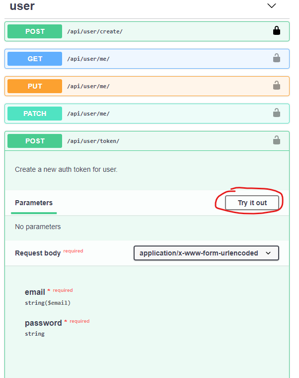
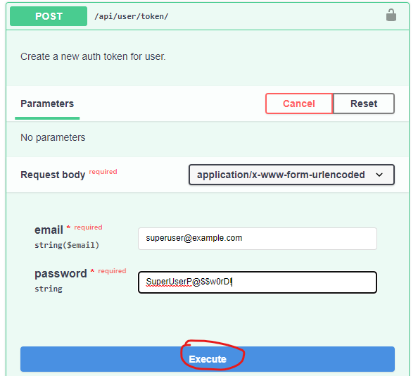
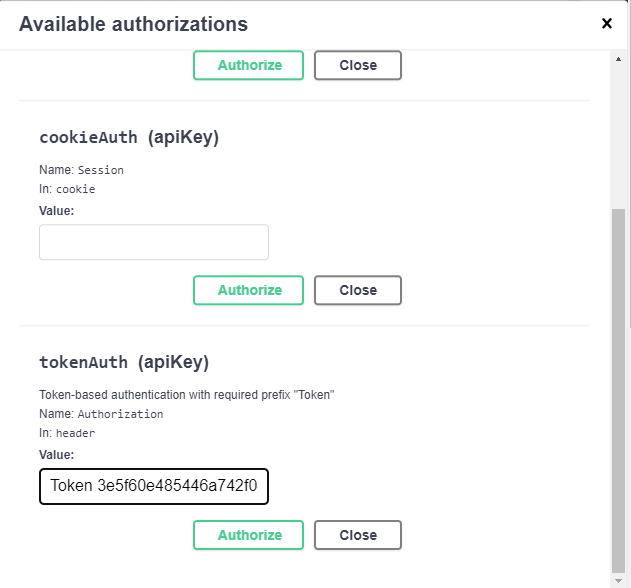

# equusense-djangoapi
Django Based API for Equusense Hardware-Client Interface Communications

## Creating a Local Implementation (For Testing Purposes)
1. Download Docker Desktop: https://www.docker.com/products/docker-desktop/
1. Run Docker Desktop
1. Clone this repo
1. Navigate to the cloned repo with a terminal or command prompt
1. Build an initial image by running `docker-compose build`. Only an initial image is required to be built; docker-compose updates the image as development continues.

## Running Tests
- This Application has been created using Test Driven Development. That is, each feature was implemented by first writing a test, then developing a solution until the test is passed. 
- To run tests for all implemented features, navigate to the root folder of the repo, and run the command `docker-compose run --rm app sh -c "python manage.py test"`. The response should include "OK" indicating that all tests have passed.

## Running the Server
- Run the server by executing the command `docker-compose up` from a terminal or command prompt at the root directory of this repo.

## Admin Panel
- To access the admin panel on a fresh image (that is, with no data), a superuser must be created by running the command `docker-compose run --rm app sh -c "python manage.py createsuperuser"`. At the prompt, type and email and password, then verify the password.
- Access the admin panel by first running the server (see above), then navigating to http://127.0.0.1:8000/admin. Enter the superuser credentials.

## Swagger Documentation
- This application was developed in conjunction with Swagger UI. To access the interactive documentation generated by Swagger, first run the server (see above), and then navigate to http://127.0.0.1:8000/api/docs.
### Using Swagger Interactive Documentation
- Several aspects of the Swagger UI first require authentication to use. To authenticate, use the POST request at /api/user/token/ to generate an authentication token. Click 'Try it out', enter a valid email and password, then click 'Execute'.

 

  - The server will respond with a token. Copy the token.

  

  - Finally authorize by clicking the 'Authorize' button at the top of the webpage, scroll down to tokenAuth(ApiKey), and type "Token {your token}" (without curly braces and replacing "your token" with the token you copied in the previous step)

  

  

  - All endpoints that require authentication can now be interactively tested.